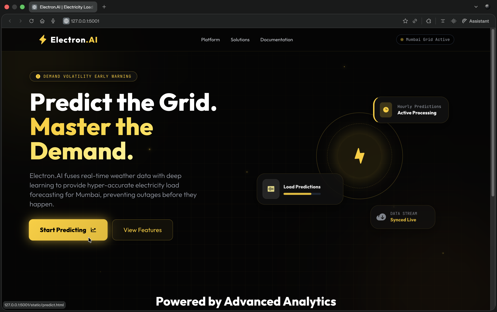
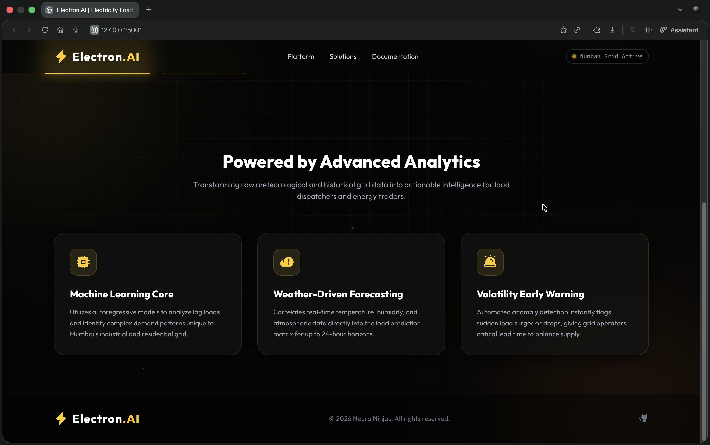
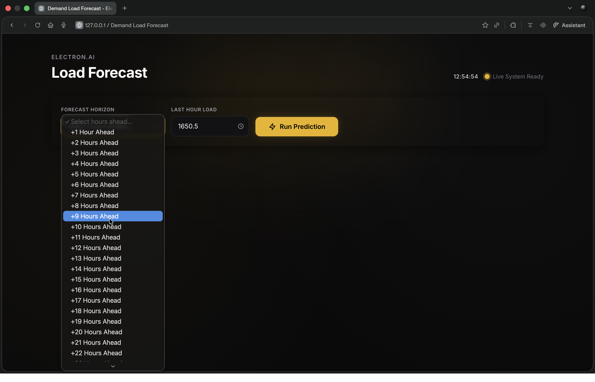
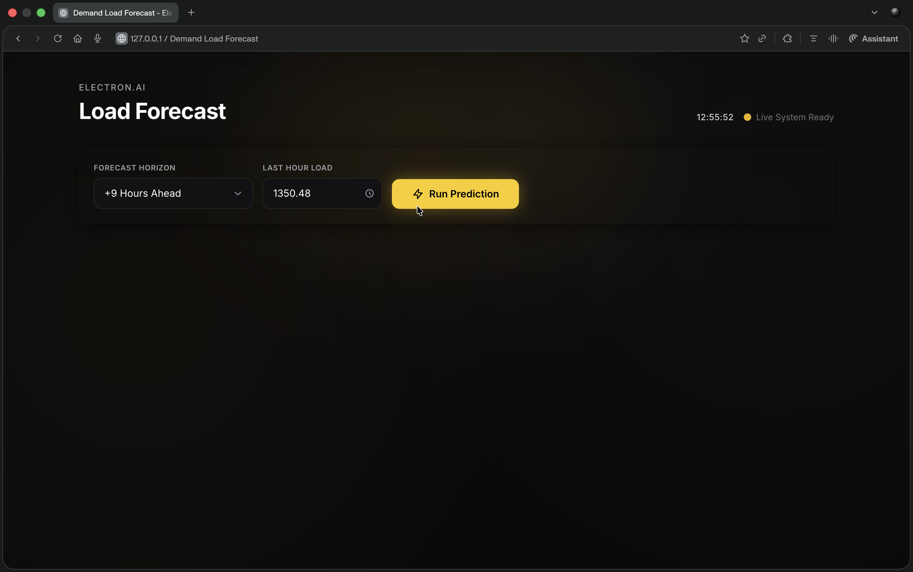
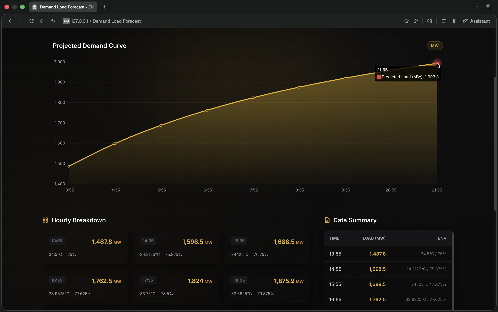
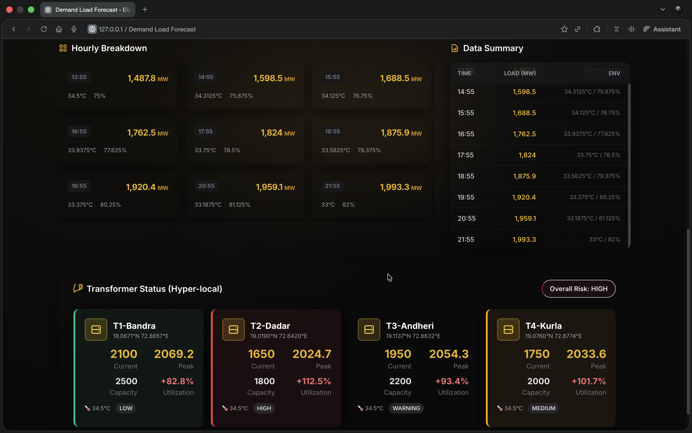
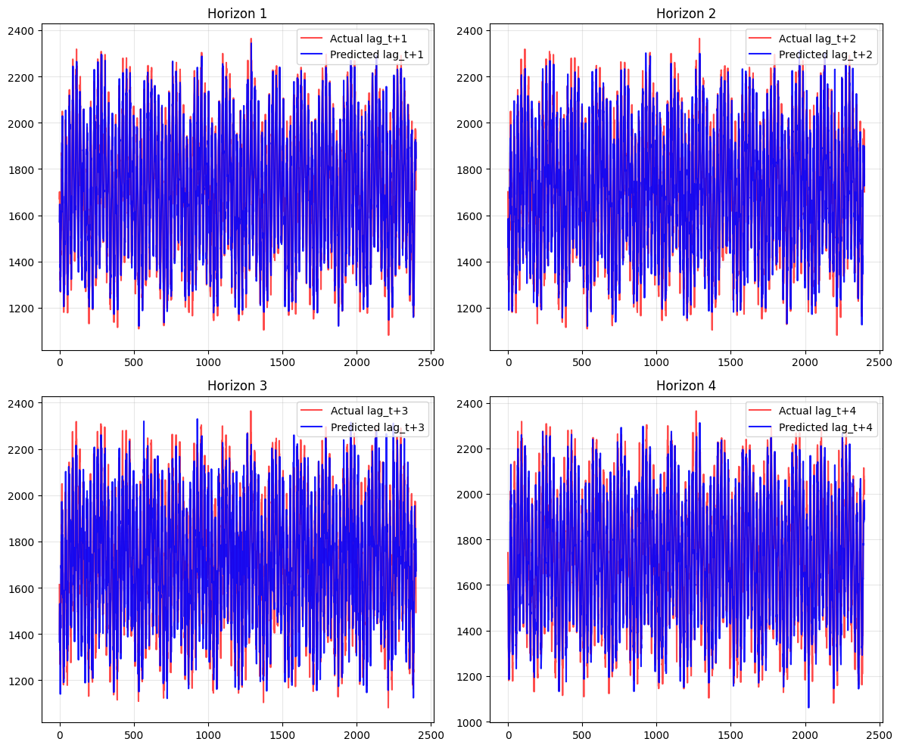

<div align="center">


### Real-Time AI-Based Electricity Demand Forecasting for Smart Grids

<p align="center">
  
  
  
  
  
</p>

> **Weather-aware, time-synchronized electricity demand forecasting system built for smart grid automation**

🚀 Generates multi-step forecasts in near real-time using historical demand data, live weather inputs, and system clock synchronization.

</div>

---

# 🔌 Project Overview

**Electron.AI** is a machine learning-based short-term load forecasting system designed for modern smart grid environments.

It integrates:

- 📊 Historical electricity demand data  
- 🌤️ Live weather data  
- ⏰ Real-time system clock  
- 📈 Multi-step forecasting (1, 2, 3 & upto 24 hours ahead)

The model is trained on historical patterns and deployed to generate forecasts aligned with real-world time.

---

# ⏰ Real-Time Automation Engine

Electron.AI operates using:

- The **current system time** of the deployed machine  
- Live weather conditions fetched at execution time  
- Trained historical demand patterns  
- Automated feature alignment with real-world timestamps  

Each prediction reflects **actual present time**, making the system:

✅ Production-realistic  
✅ Fully automated  
✅ Deployment-ready  
✅ Suitable for operational decision-making  

The entire system was **designed, developed, and coded completely from scratch**.

No automation platforms (like n8n).  
No workflow builders.  
No low-code orchestration tools.

---

# 🧠 Feature Engineering Logic (Current Version)

The current version is a **weather + calendar driven forecasting model trained on historical demand data**.

It learns relationships like:

```
(Historical Patterns + Time + Calendar + Weather) → Future Load
```

### Input Features

- Hour of day  
- Day of week  
- Weekend indicator  
- Holiday indicator  
- Temperature  
- Humidity  

### Output Targets

- Load at t + 1 hour  
- Load at t + 2 hours  
- Load at t + 3 hours
- ...... 
- Load at t + 24 hours  

⚠️ Note:  
This version does **not yet include autoregressive lag features (t-1, t-2, etc.)**.  
Lag-based learning will be introduced in the next model iteration.

---

# 🤖 Machine Learning Architecture

- Model Type: **Multi-Output Linear Regression**
- Forecast Horizon: 1, 2, 3 and upto 24 hours ahead in a single forward pass
- Built entirely from scratch

### 📊 Data Scaling

Scikit-Learn was used for:

- Scaling input features before training  
- Scaling output demand labels before regression  
- Inverse-transforming predictions back to MW scale  

This improves:

✅ Numerical stability  
✅ Convergence behavior  
✅ Model generalization  

The repository includes:

📁 `AIML/` folder  
- Jupyter Notebook  
- Training pipeline  
- Validation results  

All experimentation and evaluation were performed independently.

---

# 📊 Model Performance

| Metric | Value |
|--------|--------|
| **MAE** | **100.39 MW** |
| Forecast Horizon | 1, 2, 3 & upto 24 Hours |

---

## 📌 What 100.39 MW MAE Means

On average, predictions deviate by:

> **100.39 MW from actual electricity demand**

For grids operating between **2000–4000 MW**, this corresponds to:

⚡ Approximately **2–5% forecasting error**

This is considered efficient for short-term load forecasting systems using exogenous variables trained on historical data.

---

# 🎨 Frontend & UI

The frontend and UI were fully **Vibe Coded**.

Meaning:

- Clean and minimal admin workflow  
- Smooth interaction design  
- Fast visualization rendering  
- Built for quick decision-making  

Admin workflow:

```
Start Predicting → Enter Horizon → Instant Forecast Curve + Metrics
```

---

# 🧩 Tech Stack

### 🖥 Core Technologies

- 🐍 **Python**  
- 🔢 **NumPy**  
- 📊 **Matplotlib**  
- 🐼 **Pandas**  
- 🤖 **Scikit-Learn**

### 🌐 Additional Components

- 🚀 **Flask** (Backend API)  
- 🌦 **OpenWeather API** (Live weather integration)

---

# 🚨 Problem Context

🇮🇳 India consumes approximately **1.4 Trillion kWh annually**

Challenges:

- 15–20% daily demand uncertainty  
- Weather-driven load fluctuations  
- Manual forecasting delays  
- Grid imbalance losses ≈ ₹50,000 Cr/year  

---

# 💡 Our Solution

Electron.AI delivers:

🤖 Automated ML forecasting  
🌡️ Weather-aware demand modeling  
📚 Learning from historical demand patterns  
⏰ Real-time system synchronization  
📊 Instant visual analytics  
⚡ Near real-time predictions  

Designed to enable **quick and intelligent grid-level decision making.**

---

# 📸 Screenshots

<div align="center">

### 🔹 Home Page View



<br><br>

### 🔹 Forecast Page





<br><br>

### 🔹 Performance Metrics


</div>

---

# 🚀 Continuous Improvement

We are actively working on:

- Introducing autoregressive lag features (t-1 → t+1 learning)  
- Improving MAE beyond 100.39 MW  
- Implementing smart peak-load alerts  
- Enabling real-time smart meter streaming  

The goal is to evolve Electron.AI into a complete:

> ⚡ Decision Intelligence Engine for Smart Grids

---

<div align="center">

### ⚡ Powering Smart Grids with Intelligent Forecasting  

---

## 📜 Copyright

© 2026 Tanmay Khomane and Atharva Jejurkar

Developed with ⚡ for intelligent smart grid forecasting.  
All rights reserved.

</div>
